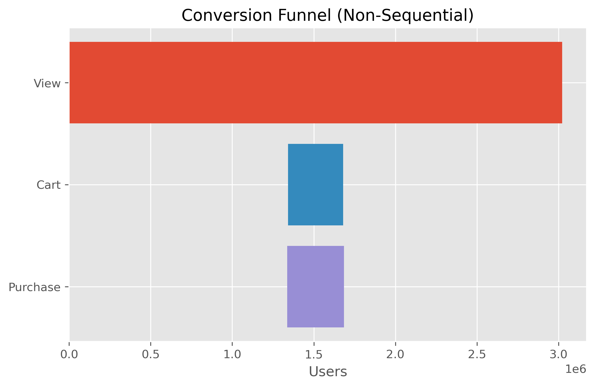
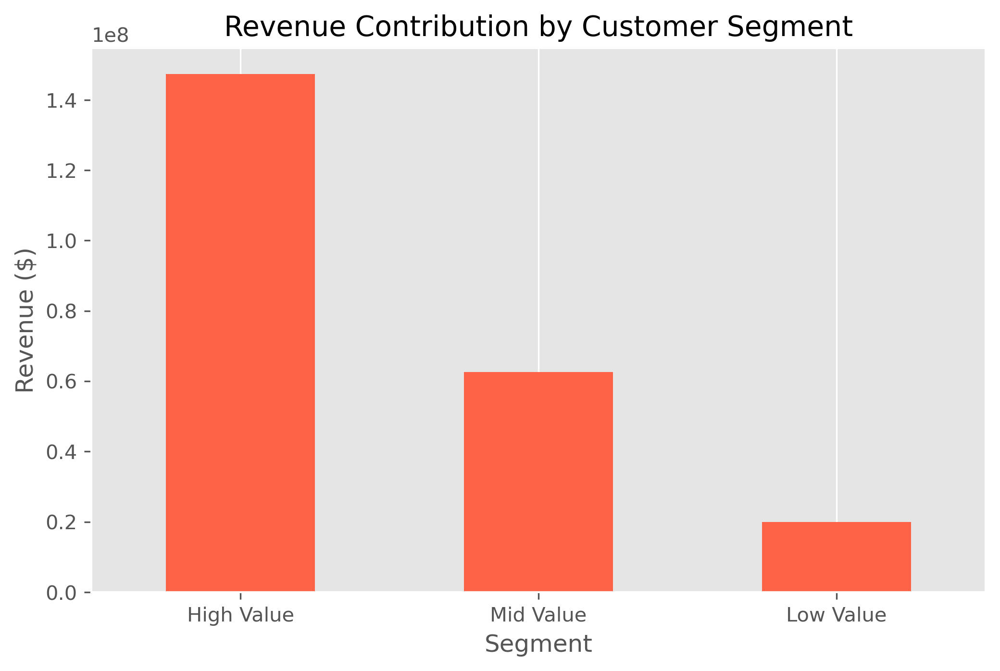

# 📊 Ecommerce Conversion & Growth Analytics

## 📌 Project Overview
This project analyzes an ecommerce user journey from product view to purchase using funnel analysis, A/B testing, and RFM-based customer segmentation. The goal is to identify conversion bottlenecks, revenue drivers, and high-value customer behaviors.

---

## 🎯 Objectives
- Analyze sequential conversion funnel performance  
- Identify drop-off points in the purchase journey  
- Evaluate revenue and purchasing behavior  
- Segment customers using RFM methodology  
- Provide data-driven growth recommendations  

---

## 🔍 Key Insights

### Funnel Performance
- View → Cart conversion: **11.15%**
- Cart → Purchase conversion: **~103%** (non-sequential artifact)
- Largest drop-off occurs at the **View → Cart** stage

📉 See funnel chart:

---

### Revenue Analysis
- Total revenue: **$229.9M**
- Orders: **742K**
- Unique buyers: **347K**
- Avg orders per buyer: **~2.14**

💡 Indicates healthy repeat purchasing behavior.

---

### Customer Segmentation (RFM)
- High-value users (~23%) drive the majority of revenue
- Mid-value users (~40%) represent strong upsell potential
- Low-value users (~37%) show weak monetization

📊 See segmentation chart:

---

## 🛠️ Tools & Technologies
- Python (Pandas, NumPy)
- Matplotlib / Seaborn
- Jupyter Notebook
- Git & GitHub

---

## 🚀 Business Recommendations
- Optimize View → Cart experience (largest friction)
- Protect and retain high-value customers
- Upsell mid-value segment
- Investigate non-sequential purchase behavior
